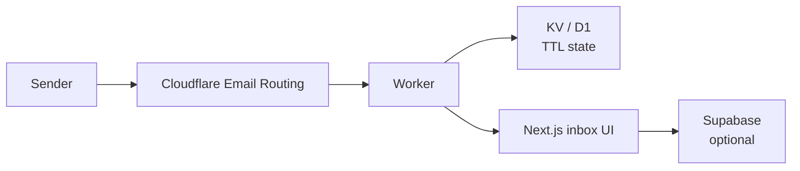

<div align="center">
  
</div>

<p align="center">
  
</p>

<p align="center">
  <strong>Disposable email in minutes.</strong> No account, no tracking, no permanent storage.<br/>
  Built on Cloudflare Workers. Inboxes die with their TTL.
</p>

<p align="center">
  <a href="#-why">Why</a> ·
  <a href="#-features">Features</a> ·
  <a href="#-architecture">Architecture</a> ·
  <a href="#-quick-start">Quick start</a> ·
  <a href="#-deploy">Deploy</a> ·
  <a href="#-configuration">Config</a>
</p>

<p align="center">
  <a href="LICENSE"></a>
  
  
  
  
</p>

<p align="center">
  
  
  
  
  
</p>

---

## ✨ Why

> *Need an inbox for one signup. Not another identity.*

Most temp-mail products keep messages, fingerprint visitors, or force an account. AtomMail is the opposite: a short-lived inbox on the edge.

| Pain | What AtomMail does |
| :--- | :--- |
| Sign-up just to receive one code | Instant disposable address, no account |
| Messages linger forever | Automatic cleanup after a short TTL |
| Tracking pixels and analytics | No tracking, no persistence by design |
| Heavy VPS for a throwaway inbox | Cloudflare Workers + KV + D1 |

Default TTL is intentionally short. Self-hosted instances can raise it in Worker / KV settings.

## 🧩 Features

<table>
  <tr>
    <td width="50%"><h3>⏱ Temporary inboxes</h3>Addresses exist only as long as the configured TTL. Empty state after expiry is expected.</td>
    <td width="50%"><h3>🛡 Privacy by default</h3>No sign-up. No tracking. Messages are never stored permanently.</td>
  </tr>
  <tr>
    <td><h3>⚡ Edge runtime</h3>Cloudflare Workers for ingest and routing. KV / D1 for short-lived state.</td>
    <td><h3>🖥 Next.js UI</h3>App Router frontend with Tailwind and Framer Motion.</td>
  </tr>
  <tr>
    <td><h3>🗂 Admin companion</h3>Dashboard lives in <a href="https://github.com/awhite0030/atommail-admin">atommail-admin</a>.</td>
    <td><h3>☁ Deploy anywhere</h3>Wrangler for the worker. Vercel or Next.js for the UI.</td>
  </tr>
</table>

## 🏗 Architecture



```text
atommail/
├── app/                 # Next.js App Router UI
├── components/
├── lib/
├── worker/              # Cloudflare Worker
├── supabase/
└── package.json
```

## ⚡ Quick start

```bash
git clone https://github.com/awhite0030/atommail.git
cd atommail
npm install
npm run dev              # UI
npm run worker:dev       # Cloudflare Worker
```

Declare KV / D1 bindings in `wrangler.toml` first. Mismatched binding names are the most common local startup failure.

## 🚀 Deploy

```bash
npm run worker:deploy
wrangler secret put SUPABASE_URL
wrangler secret put SUPABASE_SERVICE_ROLE_KEY
```

After deploy, confirm KV and D1 bindings in the Cloudflare dashboard and watch Worker logs. Free-tier KV write limits can fail cleanup under heavy use.

## ⚙ Configuration

| Variable | Purpose |
| :--- | :--- |
| `SUPABASE_URL` | Supabase project URL (optional / admin path) |
| `SUPABASE_SERVICE_ROLE_KEY` | Service role for worker / admin |

Inbox lifetime is approximate and depends on TTL plus the worker schedule. A very short TTL can look empty quickly — that is expected.

## 📄 License

[MIT](LICENSE) © 2026 A. White

<div align="center">
  
</div>
